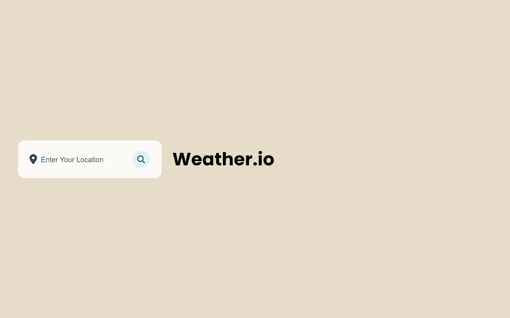
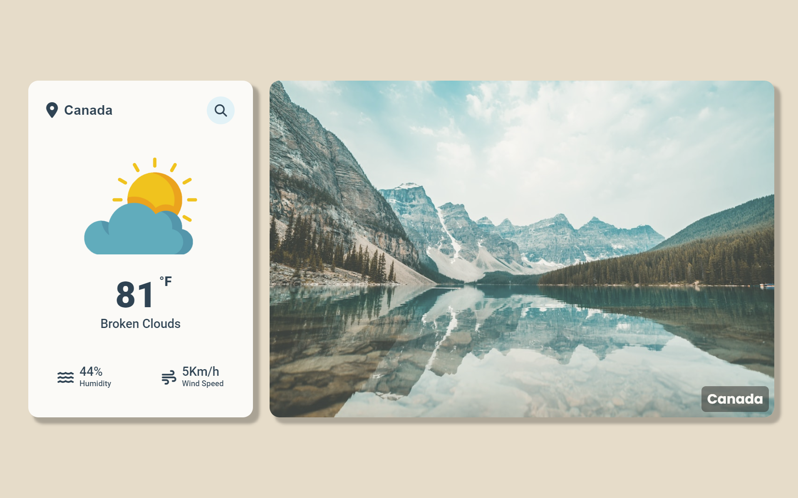
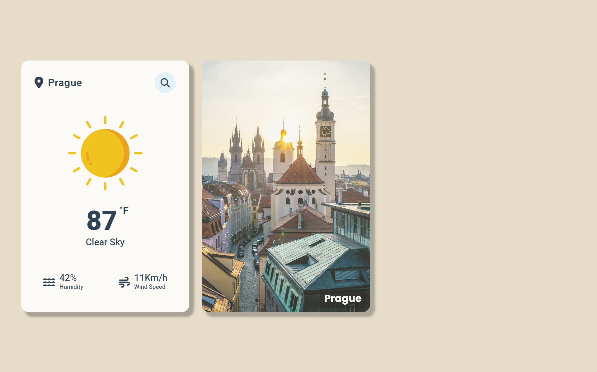

# WeatherApp
Stay informed with accurate, hyperlocal forecasts and real-time weather alerts through our intuitive and user-friendly weather app. This simple project integrates data from OpenWeather and Unsplash, focusing on presenting weather information in a clear yet visually appealing manner. It highlights my ability to effectively utilize JavaScript and CSS to create an interactive and aesthetically pleasing website.

# Screenshot

